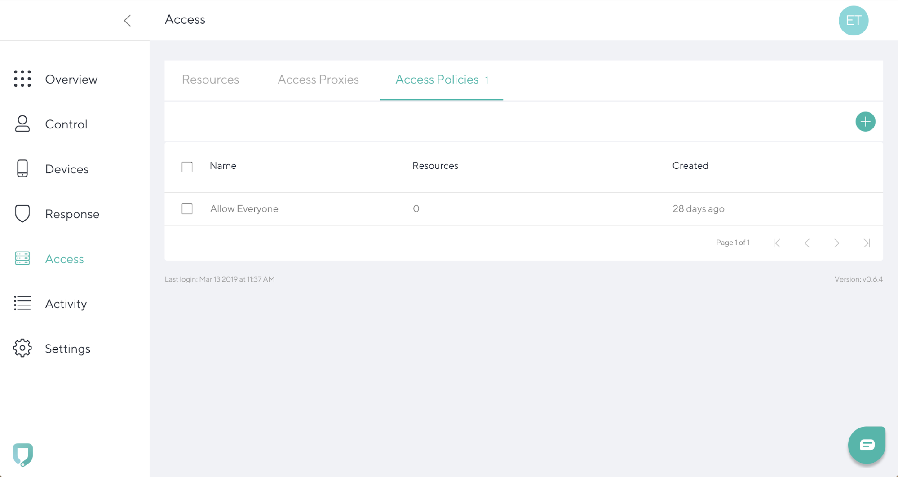
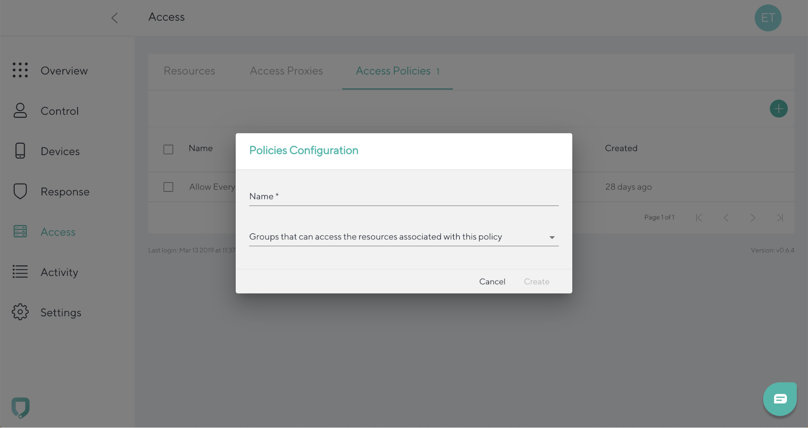

# Add new policy

To add an access policy, go to the **Access tab** and navigate to the **Access Policies**. Click the **“+”** icon in the top right.

Add **Name** and select groups that can access the resources associated with this policy and click **Create**. 

To cancel the entry and go back to the **Access tab**, click **Cancel**.
