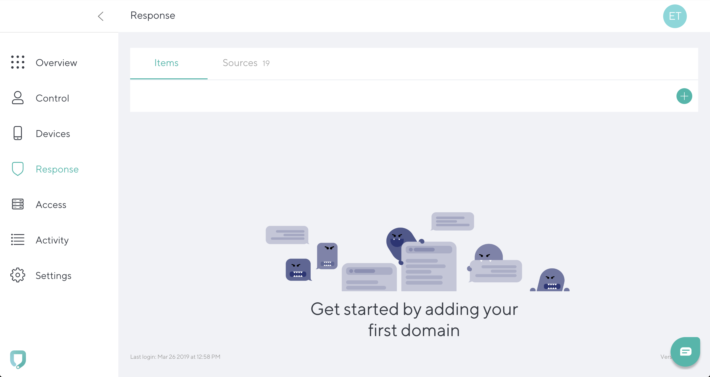
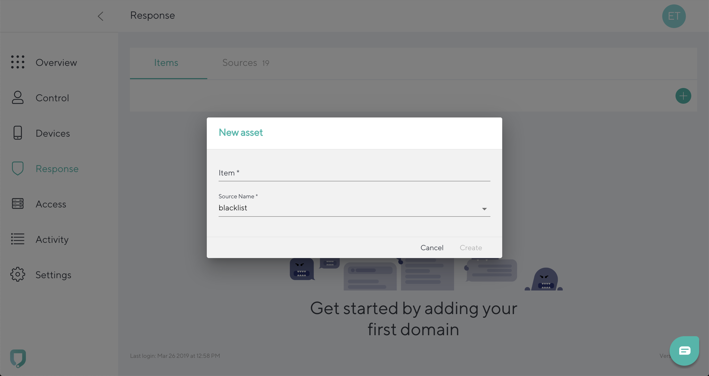

# Blacklist a domain

To blacklist a domain, go to **Response tab** and click the **“+”** icon in the top right. 

Add **Domain** (Item), and select **blacklist** as a source name. Click **Create**. 

To cancel the entry and go back to the **Response tab**, click **Cancel**.
