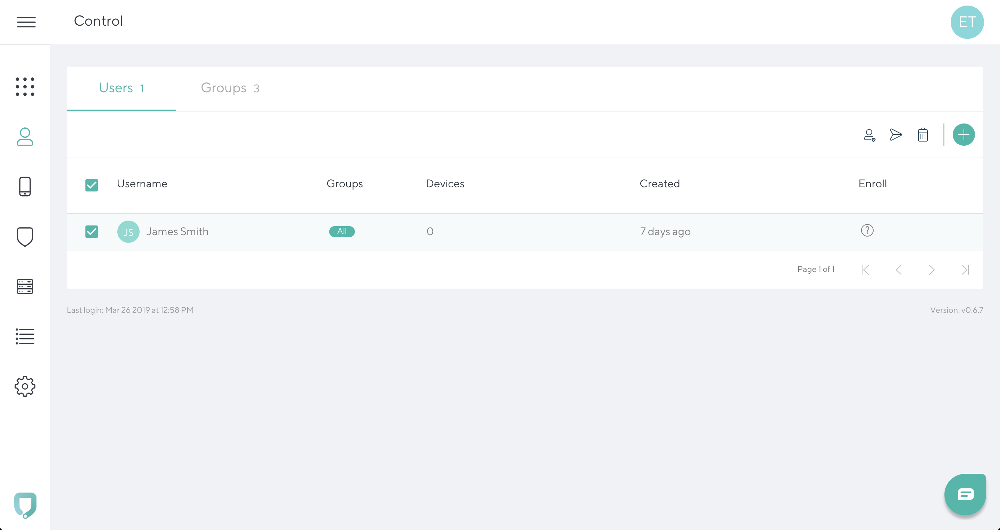
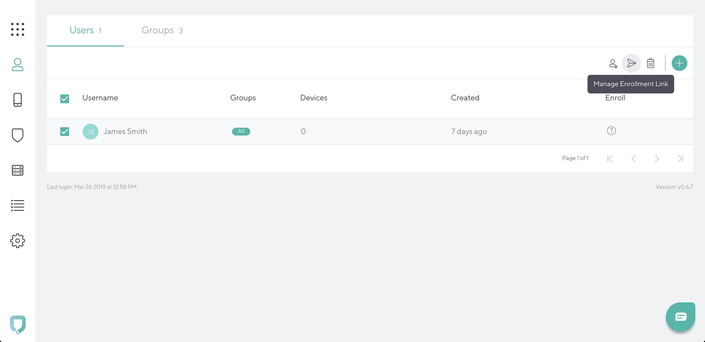
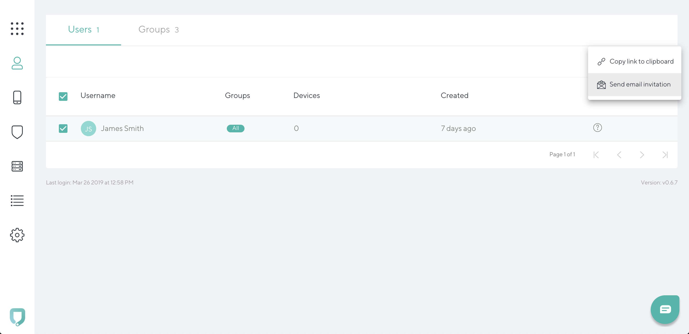

# Resend enrollment email

To resend an enrollment email to the user, go to the **Control tab** and click on the selected user name.

 

Click on a link icon in the top right of the tab.

 Click on **Send email invitation**.
