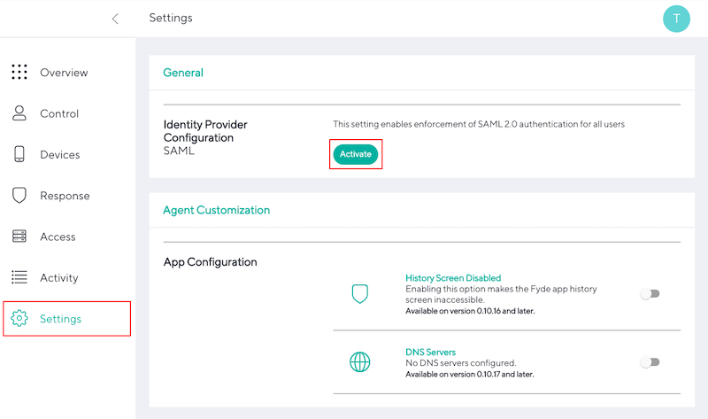
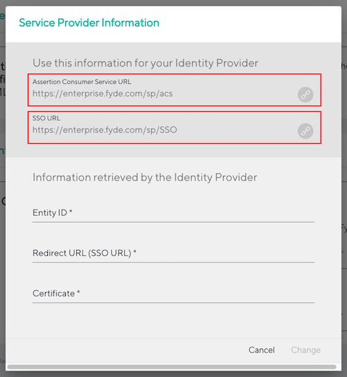

# Fyde Enterprise Console SAML

- These are the common steps required to configure SAML authentication for enrolling devices

## Configure SAML

1. Select `Settings` - `General` - `SAML` - `Activate`

    

1. Please take note of the fields your provider will require:

    - Identifier (Entity ID) (missing from the image)

    - Assertion Consumer Service URL

    - SSO URL

    

1. Follow one of the [provider specific](../add_saml.md#provider-specific) steps to obtain the required fields:

    - Entity ID

    - Redirect URL (SSO URL)

    - Certificate
