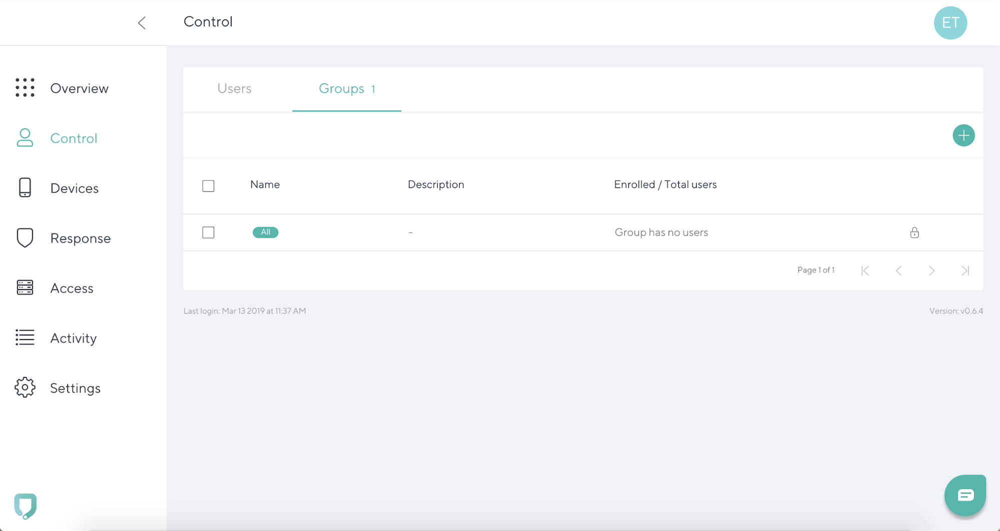
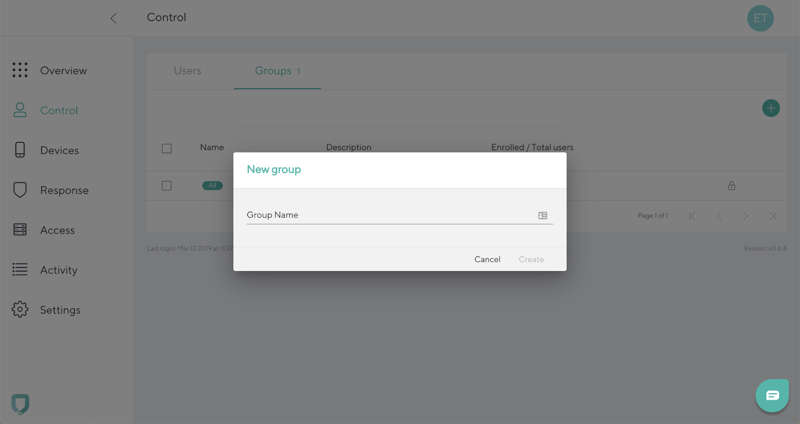

# Adding a group

To add a new group, go to **Control tab** and navigate to the **Groups** Click the **“+”** icon in the top right. 

Add **Group Name**, and click **Create**. 

To cancel the entry and go back to the **Control tab**, click **Cancel**.
