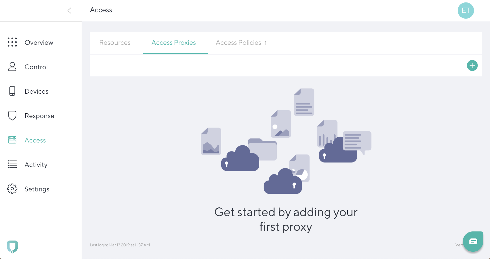
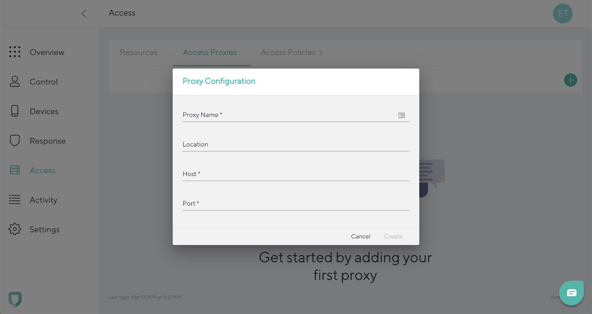
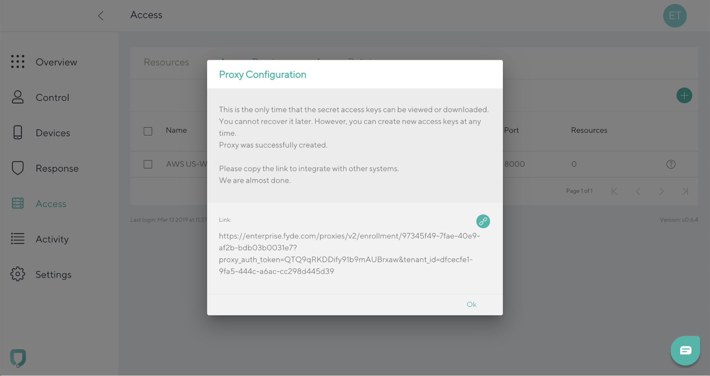

# Adding a proxy

To add an access proxy, go to the **Access tab** and navigate to the **Access Proxies**. Click the **“+”** icon in the top right.

Add **Proxy Name**, **Location** (optional), **Host** and **Port**. Click **Create**. 

To cancel the entry and go back to the **Access tab**, click **Cancel**.

Copy the link to integrate with other systems.

