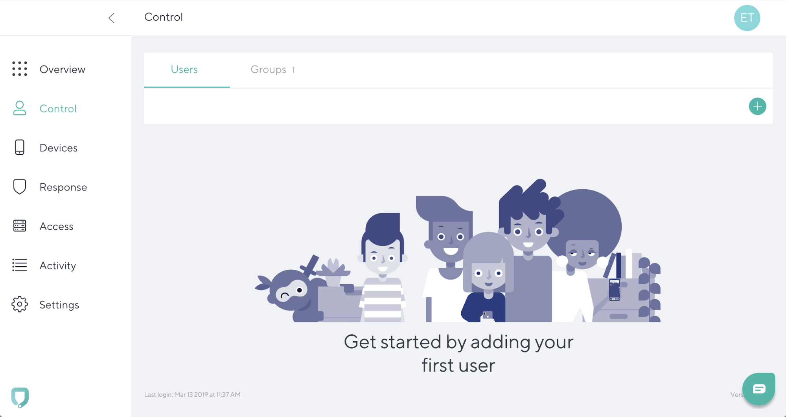
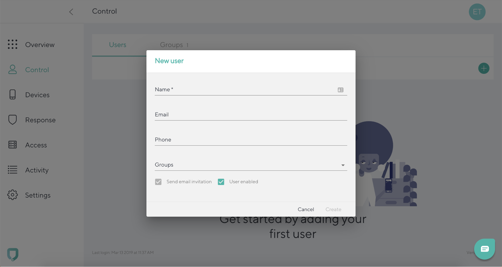

# Adding a new user

To add a new user, go to **Control tab** and Click the **“+”** icon in the top right. 

Add **Name, Email** (optional), **Phone** (optional) and if relevant select a **Group** that the user is part of. Click **Create**. 

To cancel the entry and go back to the **Control tab**, click **Cancel**.
