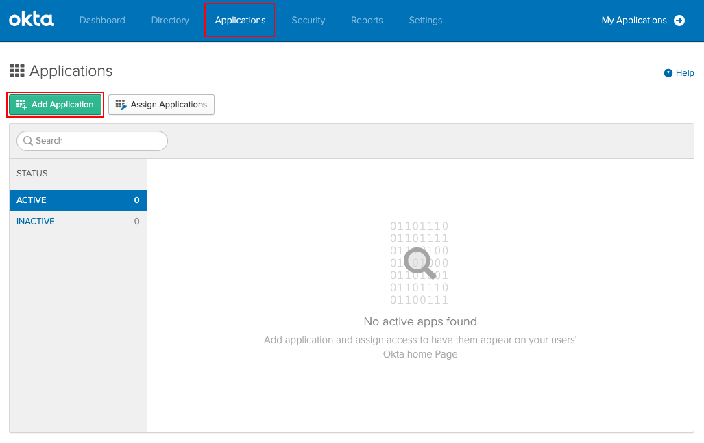
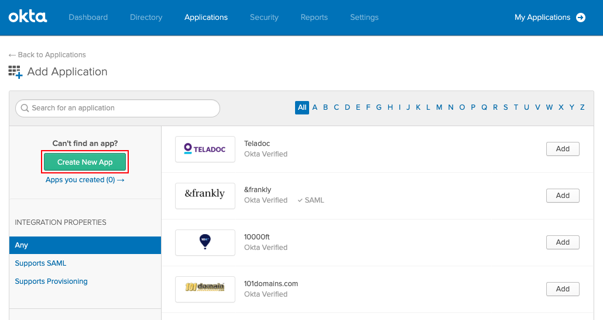
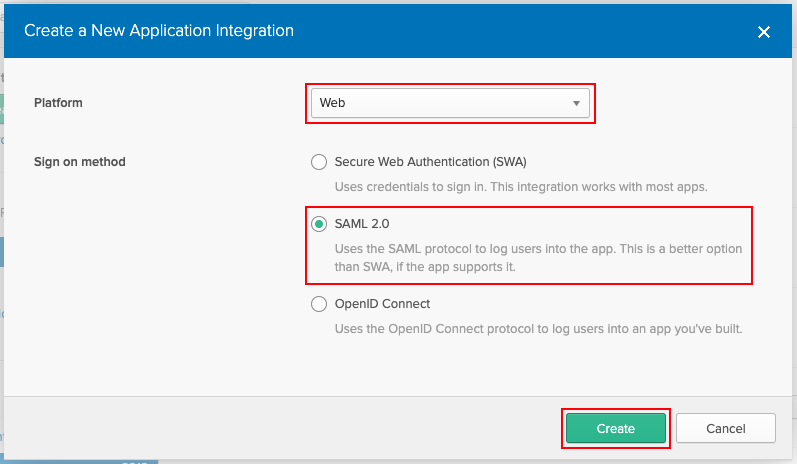
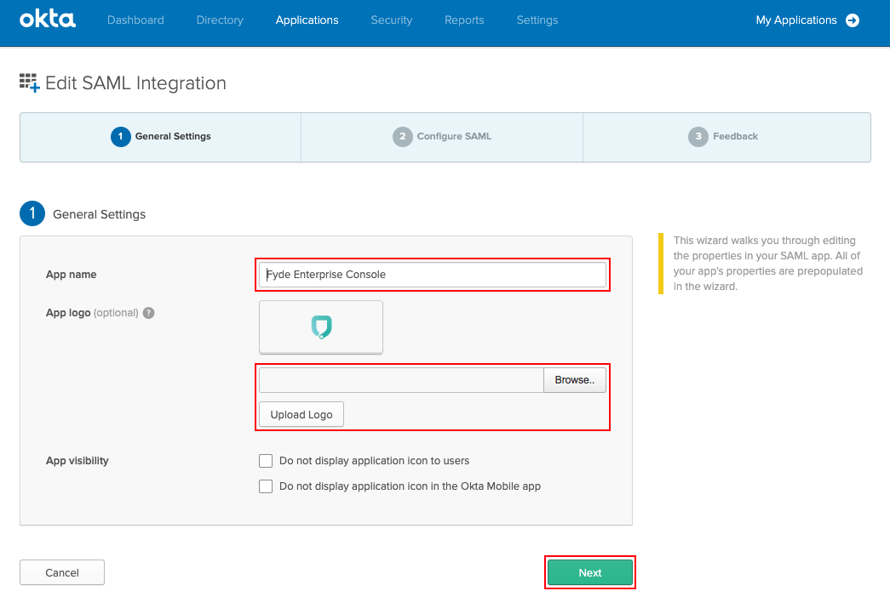
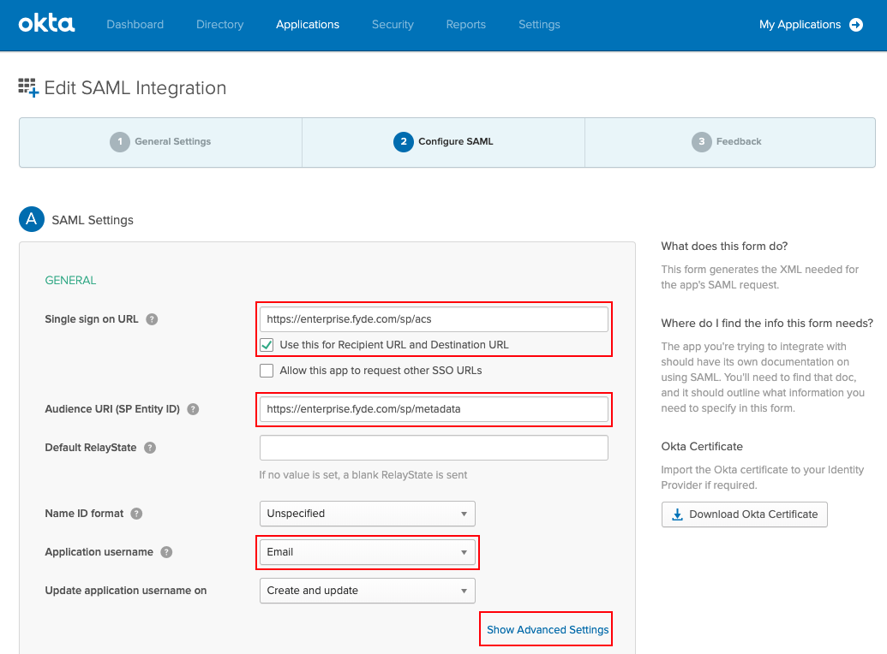
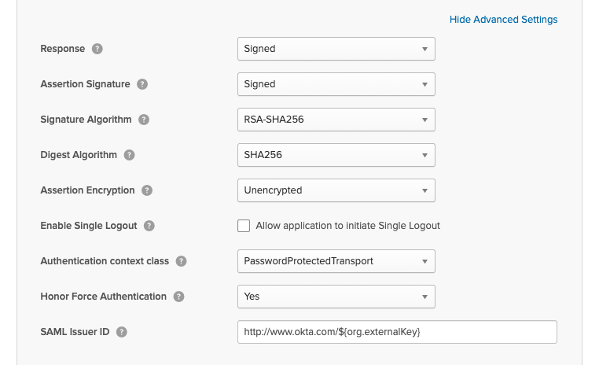
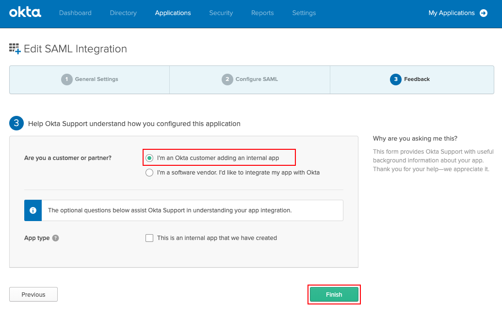
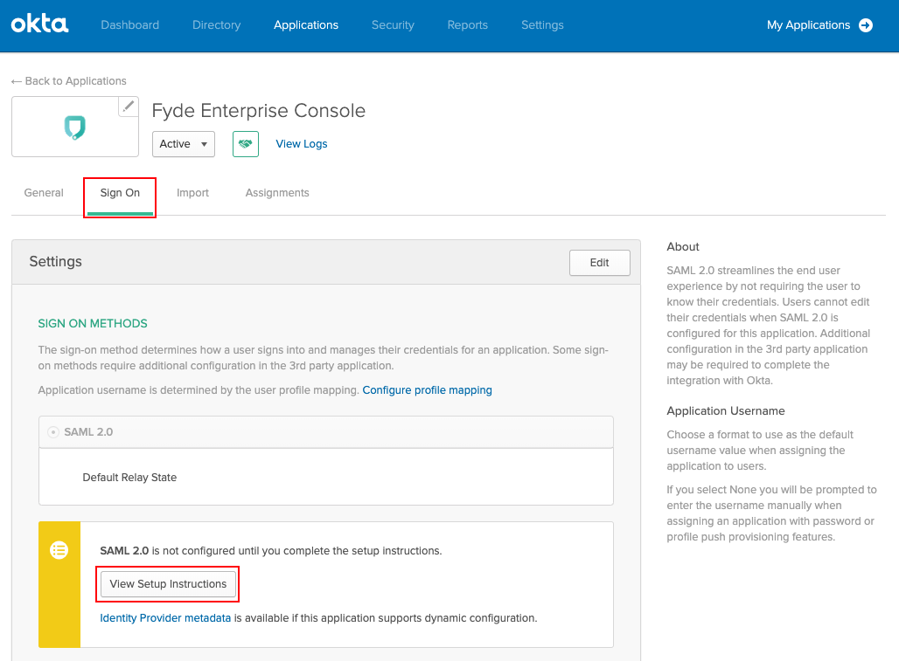
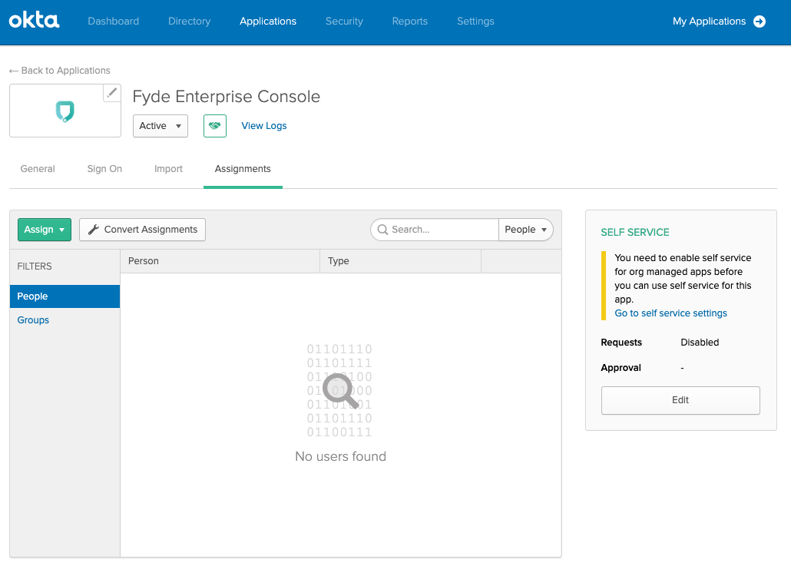

# Okta SAML

Steps to create an Okta SAML application to use with Fyde Enterprise Console

- The steps were retrieved from this tutorial `https://developer.okta.com/standards/SAML/setting_up_a_saml_application_in_okta/`

## Configure SAML

1. Log in to your Okta organization as a user with administrative privilege

1. Create a new application by selecting `Applications` and then `Add Aplication`

    

1. Select `Create New App`

    

1. Configure custom application type

    - Select Platform `Web

    - Select Sign on method `SAML 2.0`

    - Click `Create` to continue

    

1. Configure custom application type

    - Insert the desired `App name` (suggestion: Fyde Enterprise Console)

    - [Optional] Use this [image](../../fyde_logo.png) to configure the `App logo` for the application

    - Select `Next` to continue

    

1. In this menu we are going to use the values obtained from step 2 in [Fyde Enterprise Console](fyde_console_saml.md):

    - Please fill in:

        - `Single sign on URL` (Assertion Consumer Service URL)

        - Ensure `Use this Recipient URL and Destination URL` is checked

        - `Audience URI (SP Entity ID)`

        - Ensure `Application username` is set to `Email`

        - Leave the remaining fields to defaults (as shown)

    - Select `Show Advanced Settings` to continue

    

1. In the `Advanced Settings` section

    - Check that all the values are set as below

    - Click `Next` to continue

    

1. Configure feedback and click `Finish`

    

1. Get provider definitions by selecting `Sign On` and `View Setup Instructions`

    - Use the values obtained to continue the step 3 configuration in [Fyde Enterprise Console](fyde_console_saml.md):

    - `Identity Provider Issuer` - `Entity ID`

    - `Identity Provider Single Sign-On URL` - `SSO URL`

    - `X.509 Certificate` - `Certificate`

    

1. This app need to be assigned to users

    - Please ensure that you configure the desired assignments

    
