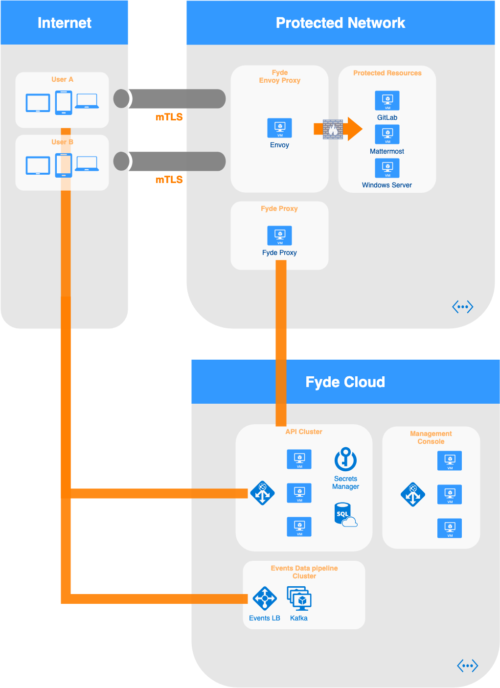
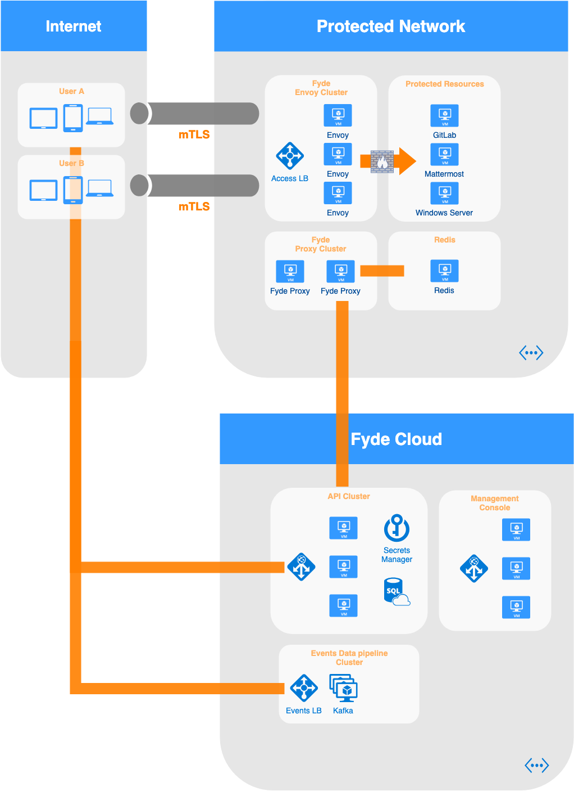

# Fyde Access Proxy network

## Requirements

- These are the network requirements for a secure working installation:

  - Internal resources (configured from Fyde Enterprise Console) can only communicate with the internal leg of Envoy Proxy

  - Envoy proxy has an internal leg and an internet facing leg

  - Internet facing leg needs to expose the configured Fyde Access Proxy port

  - For Highly Available mode (HA), Envoy Proxy needs to be placed behind a Layer 3 Round Robin Load Balancer

## Firewall configuration

NOTE: assuming default values

| Component                 | Description                   | Direction | Protocol / Port       | Mode    |
| ------------------------- | ------------------------------| --------- | --------------------- | ------- |
| Envoy Proxy               | Access port                   | Inbound   | Configured in Console | All     |
|                           | Registered resources          | Outbound  | Configured in Console | All     |
|                           | Fyde Proxy Orchestrator       | Outbound  | TCP 50051             | All     |
|                           | Envoy Proxy Cluster           | Any       | Any                   | HA mode |
| Fyde Proxy Orchestrator   | Envoy Proxy Cluster           | Inbound   | TCP 50051             | All     |
|                           | Fyde Enterprise Console API   | Outbound  | TCP 443               | All     |
|                           | Redis                         | Outbound  | Configured Redis port | HA mode |

## Network diagrams

### Single mode

### Highly Available mode

- NOTE: Redis Replication is out of the scope for this document
  - Please check `https://redis.io/topics/replication`

