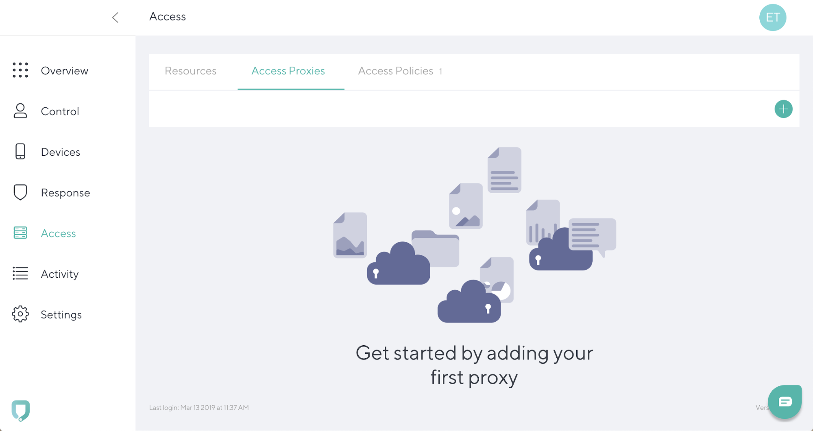
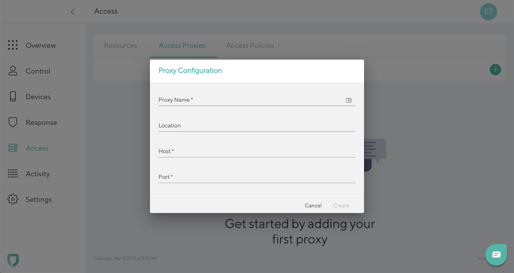
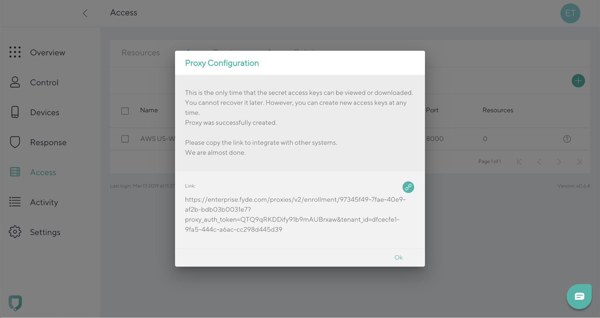
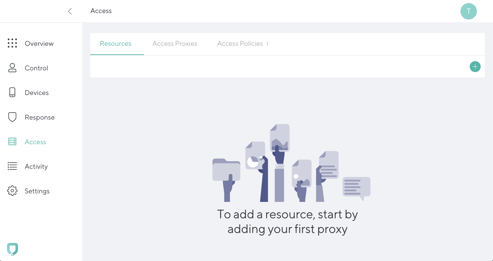
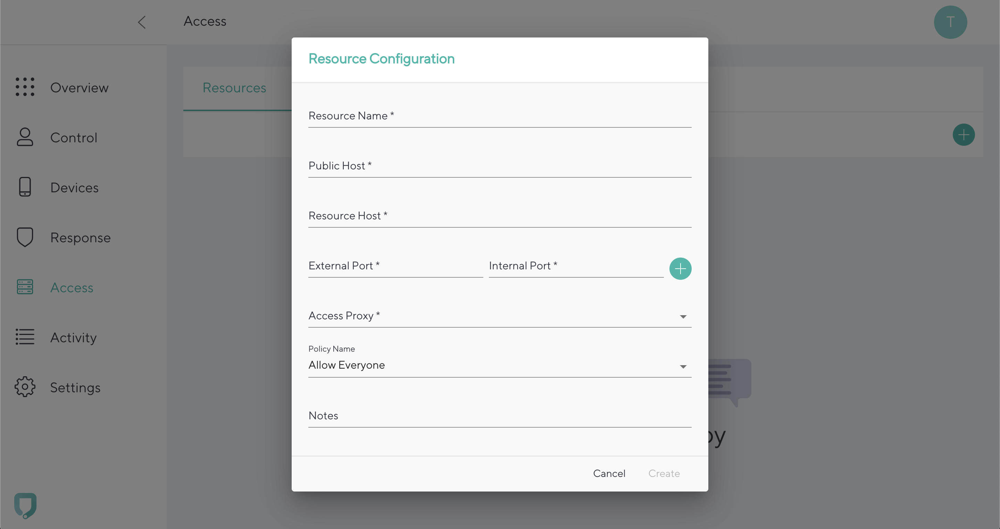
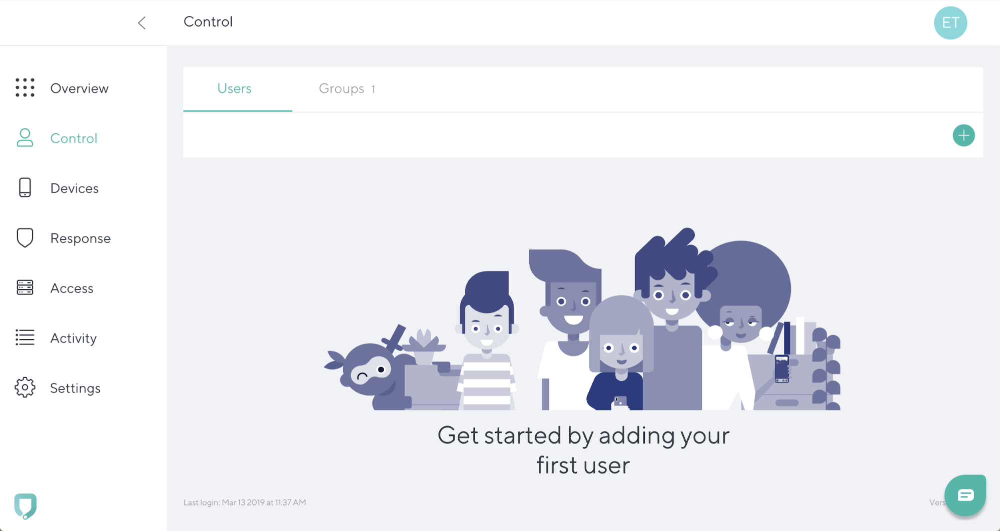
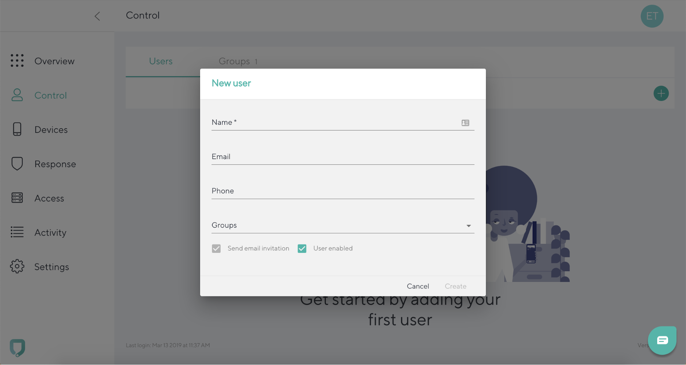

# Quick Start

Follow these steps to perform the required configuration to access a resource protected by a Fyde Proxy.

## Add new proxy

To add an access proxy, go to the **Access tab** and navigate to the **Access Proxies**. Click the **“+”** icon in the top right.



Add the following:

- **Proxy Name**: Used to identify the proxy
- **Location**: Optional, for your reference only
- **Host**: IP/DNS record used to reach the proxy
- **Port**: Port where the proxy will be available

Click **Create**.



Copy the link that will be used when configuring the proxy.

Please Note: This is the only time the link is provided by the Management Console.



## Install Fyde Proxy in Docker

- The required images are available in Dockerhub registry under the organization [FydeInc](https://hub.docker.com/u/fydeinc)

- Instalation requires a valid [Proxy Enrollment Link](../console/configurations/add_proxy.md#adding-a-proxy)

- Tested in:
  - Ubuntu 16.04
  - Centos 7

- Choose [**Install script**](##install-script) or [**Manual steps**](##manual-steps) to proceed

### Install script

- Please note that the steps below will execute scripts obtained externally
- We advise to inspect the content before execution

1. Download and execute script

    ```sh
    curl -fsSL https://url.fyde.me/install-fyde-proxy-docker \
        -o install-fyde-proxy-docker.sh
    sudo bash install-fyde-proxy-docker.sh
    ```

### Manual steps

#### Pre-requisites

- [Docker](https://www.docker.com/get-started) (version 18.02.0+)

- [Docker Compose](https://docs.docker.com/compose/install/) (version 1.21.0+)

#### Docker Compose

1. Create the docker compose file

    - Download the docker-compose file definition:

        - [docker/docker-compose.yml](docker/docker-compose.yml)

    - Make sure configured port matches the one configured in the Management Console

    - Update `FYDE_ENROLLMENT_TOKEN` value with `Proxy Enrollment Link`

1. Start the services (detached)

    ```sh
    sudo docker-compose -f docker-compose.yml up -d
    ```

1. Check logs

    ```sh
    sudo docker-compose -f docker-compose.yml logs -f
    ```

## Add new resource

To add a new resource, go to **Access tab** and click the **“+”** icon in the top right.



Fill in the details:



- **Resource Name**: Simple identifier for the resource in the console

- **Public Host**: Hostname used by the Fyde Client (in the device) to redirect the request to the Access Proxy
  - Needs to be a valid DNS record
  - Doesn’t need to exist as a public DNS record, private or at all

- **Resource Host**: Internal resource hostname or IP used by the Access Proxy to connect to
  - Needs to be a hostname or IP that the Access Proxy can resolve and connect to

- **External Port**: Port used for the request to the Public Host from the device

- **Internal Port**: Internal Resource port used by the Fyde Proxy to connect to the Resource Host

- **Access Proxy**: The Access Proxy that will be used and has access to the resource being configured

- **Policy Name**: The policy used to allow access for this resource

- **Notes**: Can be used to add extra information regarding the resource

Please note:

- When accessing an internal resource with HTTPS configured, the **Public Host** needs to match the configured hostname in the resource certificate

## Add new user

To add a new user, go to **Control tab** and Click the **“+”** icon in the top right.



Add the following:

- **Name**: Name to identify the user
- **Email**: Required to send the enrollment to the user link via email
- **Phone**: Optional, for your reference only
- **Group**: Optional, groups that the user is part of

Click **Create**.



## Access created resource

- Enroll a new device for the created user by acessing the enrollment link
  - The link is sent to the email configured for the user or by sharing the link from the user details

- Access the configured resource
